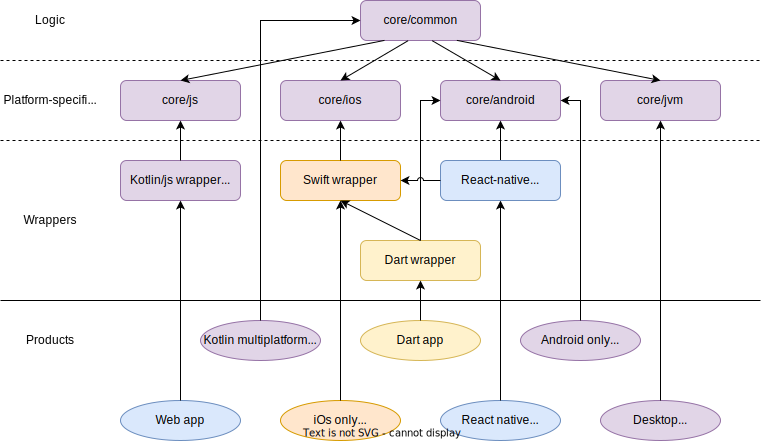

## Using the project

You need to create a local properties file in the root of the project with the following properties:

```properties
# Path to the android sdk, by default on mac /Users/you/Library/Android/sdk
sdk.dir=/path/to/android/sdk
# Name of ios simulator to use for testing, e.g. iPhone 13 Pro Max
ios.simulator=iPhone name
```

## Testing

Unit tests can run on all target platforms (jvm, js browser, js node, ios, android) using the various gradle `[platform]Test` tasks, or using the `allTests` task.

E2e tests are currently only available on the jvm platform, as the test setup library is not yet available for the other platforms.

### Browser tests

Currently the project is configured to do browser tests on Chrome and Firefox. You will need to have the browsers installed on your machine.

You may also need to specify the location of their executables through environment variables, such as:

```
FIREFOX_BIN=/Applications/Firefox.app/Contents/MacOS/firefox
```

## Multiplatform sdk modules

### Kryptom - kotlin crypto multiplatform

This could be technically a separate project, but for now only what is needed for the iCure sdk is implemented.

Provides access from kotlin multiplatform to:
- Native cryptographic primitives and digest algorithms including:
  - Secure random
  - Aes encryption
  - Rsa encryption and signing
  - Hmac signing
- Byte array encoding and decoding (hex, base64)

## Notes

With multiple modules the yarn lock may have some issues...
https://youtrack.jetbrains.com/issue/KT-55701/KJS-Gradle-kotlinUpgradeYarnLock-and-kotlinStoreYarnLock-dont-support-configureondemand-if-building-one-module-only

## Original organization plan 



The core module contains the logic of the iCure sdk. Part of this logic, such as encryption, requires platform-specific 
implementations, using the platform sdks.

The core module can be used as-is from java or kotlin android apps, desktop java or kotlin apps or other 
kotlin/multiplatform apps. For every other platform we need to create wrappers.

### Swift wrapper

This is not mandatory since the compiled ios module is compatible with objective-c and it is possible to use objective-c
libraries from swift, but this wrapper allows to use the iCure sdk in a more natural way for swift developers.
For example this wrapper allows to use kotlin suspend functions as swift async functions, instead of normal functions 
with completion callbacks.

### Kotlin/js wrapper

This wrapper allows to use the iCure SDK from typescript or javascript. The compiled kotlin/js can run but is not 
callable from javascript/typescript. In order to allow the usage of kotlin functions from javascript we have to mark the 
members with `@JsExport`, but this is not allowed on members with some types or other characteristics. The wrapper
performs the necessary conversions and makes the exposed API callable from javascript.

### Dart and react native wrappers
These wrappers allow to use the iCure sdk from react native or dart. They connect the react/dart interfaces to the ios 
and android implementations.
